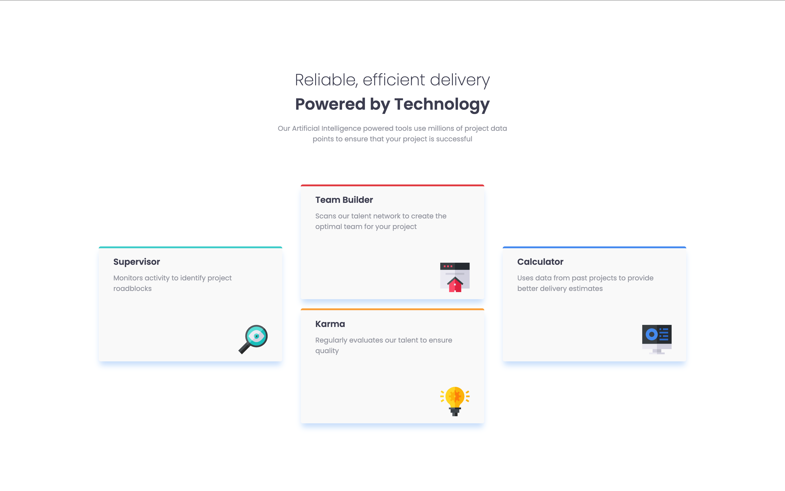
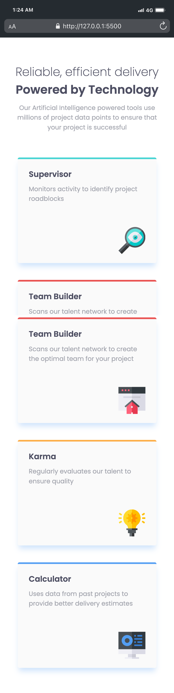

# Four Card Feature Section

Essa é uma solução para o [Desafio: "Four Card Feature Section" do Frontend Mentor](https://www.frontendmentor.io/challenges/four-card-feature-section-weK1eFYK). Os desafios que esse site oferece ajuda desenvolvedores a melhorar suas habilidades de código!

## O Desafio

### Requisitos

- O site deve funcionar em diferentes resoluções mantendo a fidelidade com o layout responsivo.

## Tecnologias Utilizadas

- HTML

- CSS

## Aprendizado

- Reforcei meus conhecimentos em Grid e suas propriedades

- Aprendi a fazer box-shadow

## Preview

### Desktop

### Mobile

